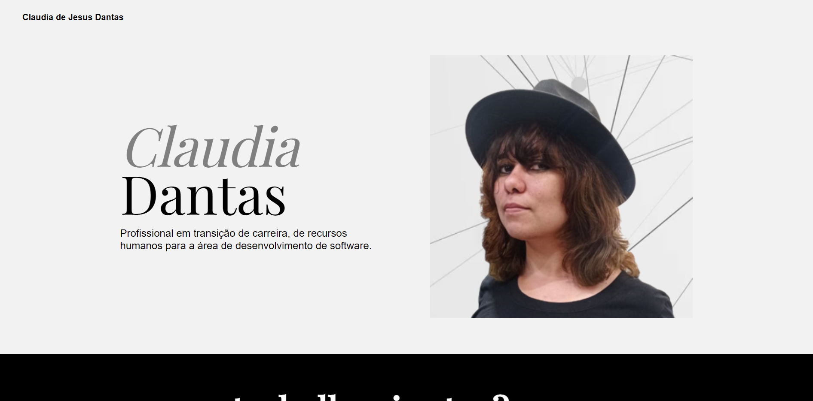
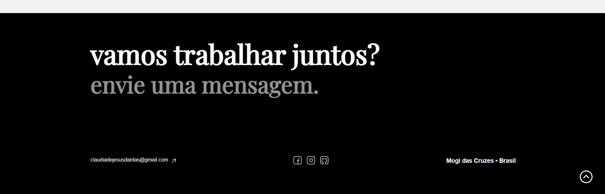

# Mini-projeto Tera - Meu Site Pessoal

Este é o repositório construído na aula **Short Project**, da professora Paula Allemand na plataforma de estudos TERA. 
O designer foi desenvolvido pela  Giulia Yosue, designer da Tera, que criou o desenho das páginas, pensando na usabilidade da pessoa usuária.
Foi utilizado HTML, CSS e JavaScript neste projeto e destina-se aos primeiros passos no desenvolvimento web.

## Conteúdo

- [Demo e Imagens](#demo)
- [Tecnologias Utilizadas](#tecnologias-utilizadas)
- [Instalação](#instalação)
- [Como Usar](#como-usar)
- [Contribuição](#contribuição)
- [Licença](#licença)

## Demo

Você pode acessar o site em [https://mini-projeto-tera-2024.netlify.app/](https://mini-projeto-tera-2024.netlify.app/).

## Tecnologias Utilizadas

- HTML5
- CSS3
- JavaScript

## Instalação

1. Clone o repositório: `git clone https://github.com/claudiadejesusdantas/mini-projeto-tera-2024.git`
2. Navegue até o diretório do projeto: `cd mini-projeto-tera-2024`
3. Abra o arquivo `index.html` em seu navegador.

## Como Usar

Basta abrir o arquivo `index.html` em seu navegador para visualizar o site. Você pode editar os arquivos HTML, CSS e JavaScript conforme necessário para personalizar o site de acordo com suas preferências.

## Contribuição

Contribuições são bem-vindas! Sinta-se à vontade para abrir uma issue ou enviar um pull request com melhorias, correções de bugs ou novos recursos.

## Licença

Este projeto está licenciado sob a Licença MIT - consulte o arquivo [LICENSE](LICENSE) para obter detalhes.

---

Desenvolvido por [Claudia de Jesus Dantas](https://www.linkedin.com/in/claudiadejesusdantas)

